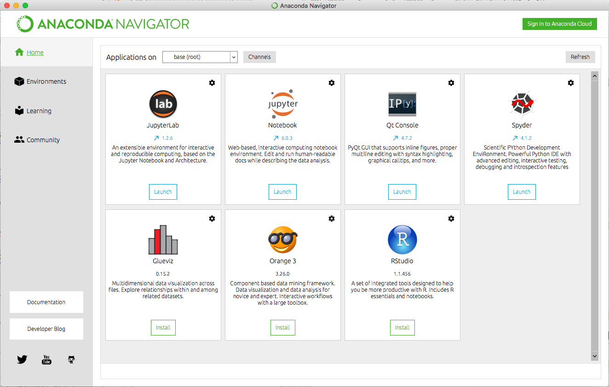

.. include:: ../special.rst

=========================================
Introduction
=========================================

As promised, for the purposes of this tutorial, I am going to assume no prior experience with computer programming, as these early steps are often a huge barrier to new programmers.  However, if you do have experience with programming, I hope that you will still read through this section as I will discuss some more high-level topics concerning programming and programming in Python specifically.

In particular, I want to spend a moment answering the questions, "What even is a programming language?" and "How, specifically, in my computer, do I do stuff with Python?"  I personally found these to be an extremely difficult questions to find answers to when I was learning to program, as most introductory coding resources focus more on the coding than the "where do I even type the code?"  I will then present some details on how to start working in Python, including how to download and install it and how to open the programs that let you start coding.  I will also leave you with a few philosophical comments about programming before the tutorial will begin in earnest.

I also want to note that my claim to expertise in writing this tutorial is solely that of a self-taught programmer who has been using Python for scientific work for over 10 years.  I also am a co-instructor of `What Do Your Data Say <https://www.whatdoyourdatasay.com>`_ at Northwestern University, and the first version of this tutorial was written for that course.  The current version is primarily dedicated toward improving student success in that course, particularly with respect to getting students quickly up to speed on attacking quantitative data sets.

*******************************
What is a Programming Language?
*******************************

For many people, interactions with computers are mediated through the use of **applications**, such as a web browser or a document editor.  These applications have been put together by a software company like Microsoft or Google and either came with your computer or you downloaded and installed them yourself.  In general, these applications are self-contained and are used to do one or a few things on your computer.  That is, Chrome and Firefox are for accessing the internet and Minecraft is for playing Minecraft, and you can't play Minecraft or access the internet via Microsoft Word.

These applications are essential for the modern use of computers and their development was a revolution in terms of how they allowed regular non-experts to efficiently use computers.  However, the fact that you can now use computers solely via applications means that the way that your computer really works is somewhat hidden.  In particular, the fact that your computer can really be directed to do *almost any task* is obscured by the way that we generally don't think about doing things with our computer that don't have an associated application.  And yet, new applications are constantly being created and disseminated by mysterious computer *programmers*, so how is it that they have access to more of a computer's abilities than you do?

.. sidebar:: Discussion

	Can you think of something you wish your computer could do but it currently cannot?  

To understand this, it's worth stating what a computer actually is; at its most basic, a computer is a pair of tools: a *processor* and some *storage*.  Storage is your hard drive, SDD, RAM, etc. - a collection of places in which the computer can *store* information, which it codes as 0's and 1's.  The processor then knows how to access, manipulate, move, and create these 0's and 1's in a set of operations that is determined by how the computer chip was designed.  In this way, any task that can be mapped to reading and writing information and then manipulating that information (which is a pretty broad class of things!) can be performed in some way by a computer.  Computer programmers can create new programs by stringing together stored information and processor-known operations in meaningful ways, such as to add two numbers or to search a database to find you a date!

When programmers work directly with the 0's and 1's in storage they are constructing **machine code**, but this quickly becomes tedious for even simple tasks, so programming is often mediated by a **programming language** that acts as an intermediary between regular language "computer, please add 2 to 3" and binary operations to return "2 + 3 = 5".  There are `hundreds of programming languages <https://en.wikipedia.org/wiki/List_of_programming_languages>`_, including `C <https://en.wikipedia.org/wiki/C_(programming_language)>`_, `Fortran <https://en.wikipedia.org/wiki/Fortran/>`_, `Java <https://en.wikipedia.org/wiki/Java_(programming_language)>`_, and of course `Python <https://www.python.org>`_.  Each of these languages differ in what and how they can translate from "human" to binary, making them more or less useful in different circumstances.

To be clear then, a programming language is a set of operations and protocols that can be combined and constructed into a **computer program** (a "code") that can be fed to a computer such that the computer will execute machine code that does something.  What you will learn in this tutorial is how to write such programs and use Python to allow your computer to interpret your program and (eventually) do useful data analysis.  This structure of constructing a code that your computer can interpret is something that all programming languages have in common, but the actual execution of that process can differ greatly from language to language.  We want to learn to write these programs to "teach" our computer how to do new things that it couldn't do before, such as visualize and analyze a novel data set.

******************
Why Python?
******************

Now that we've tackled the larger question to determine that programming languages allow us to tell computers how to do new, interesting things, you may wonder why we would choose Python out of the hundreds of possible options!  There are several reasons, some practical, and some aesthetic that I recommend Python as the best language for working with data:

1. Python is a **versatile language** that is used by programmers and scientists in a wide variety of fields.  This means that Python has a broad and robust community with many, many resources for its use and development.  This makes it easier to learn and use, but is also practical in that learning Python doesn't pigeonhole you into a specific application.
2. Python is **free**!  Unlike other programs for data analysis like MATLAB or SPSS, you will never lose access to programming in Python.
3. Python was **designed intentionally** to have a specific user experience, which means that reading and writing Python code is easy compared to many other languages.  It also wasn't designed with a specific application in mind, which is largely why it has been adopted and adapted into so many areas.
4. As mentioned, Python has an **active online community**, which is facilitated by the ease with which Python packages (also called **modules**) can be shared between users.  As a result, it is a common experience for Python programmers to type ``python my-problem`` into Google in order to find that someone has written usable code to solve your problem!  Python itself is maintained by the non-profit `Python Software Foundation <https://www.python.org/psf>`_.
5. Python is an **object-oriented language**.  We'll talk about this later, but this type of language has some advantages, especially in working with data.
6. Python can be used both to write large applications that can be packaged up and sent to other people or as a quick interactive language via programs such as `Jupyter Notebooks <https://jupyter.org>`_.  This means that Python can be used from the very early exploratory phases of a project through to the very end of a pipeline development (for example).  We'll make exclusive use of Jupyter notebooks in this tutorial, and explain how they work shortly.

Now that we've framed what we're doing, let's get to work!

********************************
Installing Python and Jupyter
********************************

While Python is usually installed on Mac and Linux computers by default, we still recommend that Python beginners start by downloading the `Anaconda <https://www.anaconda.com>`_ data science platform, which will provide a more traditional, application-style interface for accessing Python and Jupyter.  To install this program, you can follow the instructions `here <https://docs.anaconda.com/anaconda/install>`_.

.. warning:: 
	
	If at any point you find yourself being asked to chose a Python version, please choose **Python 3**.  If you are not asked, you are probably getting Python 3.

Depending on whether you are using a `Windows <https://docs.anaconda.com/anaconda/install/windows>`_ or `Mac <https://docs.anaconda.com/anaconda/install/mac-os>`_ computer (or `Linux <https://docs.anaconda.com/anaconda/install/linux>`_!) you should follow the appropriate set of instructions.  For Windows and Mac, this should be a familiar process: download the installer and click next until it's done.  You will be presented with options for changing where Anaconda will be installed and for how many users, but the defaults should work perfectly for most users.  At the end, the installer will ask you if you want to install `PyCharm <https://www.jetbrains.com/pycharm>`_, which is an application for interacting with Python.  You can do so if you want, but it will not be used or discussed further in this tutorial.

.. admonition:: Windows Users
	
	The installer will ask you if you want to "Register Anaconda3 as my default Python 3.7".  Unless you know what you are doing, I would **strongly suggest** that you check this option.  (See image below.)

.. image:: win-install-options.png
	:height: 400px
	:align: center

.. rubric:: No-Anaconda Install

If you do not want to use Anaconda in order to use Python, you have a few different options.  You can always download and install Python directly from `python.org <https://www.python.org/downloads/>`_ (making sure to get Python 3!) you can then install Jupyter by entering the following into the `Windows Command Prompt <https://www.lifewire.com/how-to-open-command-prompt-2618089>`_ or `Mac/Linux Terminal <https://support.apple.com/guide/terminal/open-or-quit-terminal-apd5265185d-f365-44cb-8b09-71a064a42125/2.10/mac/10.15/>`_:

.. code-block:: bash
	
	python -m pip install -upgrade pip

This installs `pip <https://pypi.org/project/pip>`_, the package installer for Python and makes sure it's up to date.  You can then run

.. code-block:: bash
	
	python -m pip install jupyter

To install Jupyter notebooks.  You will have to access Jupyter notebooks from the Command Prompt/Terminal as explained below.

**************************************
How to Use Python: Jupyter Notebooks
**************************************

As mentioned, there are a variety of ways that we can actually enter Python commands and feed them to our computer to do things, but one of the most popular is to use `Jupyter Notebooks <https://jupyter.org>`_.  As you'll see, these are interactive browser-based sessions that quickly allow you to start typing Python commands.

If you installed Anaconda as recommended above, then you can open the `Anaconda Navigator <https://docs.anaconda.com/anaconda/user-guide/getting-started/#open-navigator>`_ where you will see a suite of data science applications like those in the image below.

The Anaconda Navigator gives you a user interface to managing the Python packages available on your computer (via the Environments tab on the left) and to read the Python documentation (via the Learning tab).  You can learn more about `managing Anaconda environments  <https://docs.conda.io/projects/conda/en/latest/user-guide/concepts/environments.html>`_ if you are iterested.

However, what we're interested in is the Jupyter Notebook tab, through which you can access Jupyter Notebooks.  To get started running Python on a Jupyter Notebook, you can follow the directions `here <https://docs.anaconda.com/anaconda/user-guide/getting-started/#run-python-in-a-jupyter-notebook>`_, which basically say to click the "Launch" button.  The result, which should appear shortly in a web browser, will look something like this:

.. image:: jupyter-dashboard.png
	:height: 170px
	:align: center

This is the `Notebook Dashboard <https://jupyter-notebook-beginner-guide.readthedocs.io/en/latest/what_is_jupyter.html#notebook-dashboard>`_, which is basically like `File Explorer <https://en.wikipedia.org/wiki/File_Explorer>`_ or `Finder <https://en.wikipedia.org/wiki/Finder_(software)>`_, and probably opened in your `home directory <https://www.pcmag.com/encyclopedia/term/home-directory>`_.  To make a new Jupyter notebook, you can click "New -> Python 3", which will look something like this:

.. image:: getting-started_Jupyter.png
	:height: 200px
	:align: center

As a reference for Jupyter basics, please bookmark `this site <https://jupyter-notebook.readthedocs.io/en/stable/examples/Notebook/Notebook%20Basics.html>`_.

Jupyter Notebooks from the Command Line
=======================================

If you don't want to use the Anaconda Navigator, to access Jupyter notebooks, either because you didn't install it or you just don't want to open it, you can use the `command line <https://docs.anaconda.com/anaconda/user-guide/getting-started/#optional-launch-spyder-or-jupyter-notebook-from-the-command-line>`_.  This consists of opening Terminal (or the Anaconda Prompt/Command Prompt on Windows) and then entering ``jupyter notebook``, which will automatically open a browser to the Notebook Dashboard.

How to Use Python: Other
=======================================

As we noted earlier, you can use Python in several ways, where we're prioritizing the Jupyter notebook for its flexibility and ease of use.  

1. You can  use Python as a scripting language, where you write Python commands in a `regular text file <http://cs.uky.edu/~keen/115/howto/howtomaketext.html>`_ with the ``.py`` extension.  You can do this in any `text editor <https://en.wikipedia.org/wiki/List_of_text_editors>`_, such as `Notepad <https://en.wikipedia.org/wiki/Microsoft_Notepad>`_, `Emacs <https://en.wikipedia.org/wiki/Emacs>`_, `Vi <https://en.wikipedia.org/wiki/Vi>`_, or my favorite, `Sublime <https://www.sublimetext.com>`_.  (If you use Word or Pages, you will need to make sure to export your file as a ".txt" file and then manually change the ending from ".txt" to ".py", so these programs are not recommended.)  

   Once you have written your **script** (what files that contain programs are often called), you can then go to the command line and type ``python my_prog.py`` to execute the commands that you put into ``my_prog.py``.  This sort of interface with Python works well if you have a long program that you want others to use as-is (or with limited inputs), as you will only need to share the ``python my_prog.py`` file with them.  This is also useful for writing **modules**, or libraries of custom Python functions that you can then :py:func:`import <https://docs.python.org/3/reference/simple_stmts.html#import>` into another Python program. (We'll discuss this in :doc:`/3_Lists_Arrays/lists_arrays`.)

   To summarize: you can open up a text editor and write Python commands and save it as a ".py" file.  Then you can execute these scripts in the command line to run the commands in order (you can also run these scripts in IPython and Jupyter!).  If you are writing a module, you can import these files as we'll talk about in :doc:`/3_Lists_Arrays/lists_arrays`.

2. **Interactively** via `IPython <https://ipython.org>`_, `Spyder <https://docs.anaconda.com/anaconda/user-guide/getting-started/#run-python-in-spyder-ide-integrated-development-environment>`_, or `PyCharm <https://www.jetbrains.com/pycharm>`_, which provide an interactive shell in which to type Python commands or run scripts, storing all the results that are created along the way.  Spyder in particular may be good for programmers who are used to MATLAB or RStudio's **Interactive Development Environments** (IDEs).

I point these other options out as references when you see someone online saying something like "put it in a script" or if you see someone talking about IDEs.  We won't assume any familiarity with these other processes in this tutorial.

*******************************
Final Introductory Notes
*******************************
At this point you are probably ready to get a move on, but I want to make a few final notes about the process of programming.  

First, programming is a *creative* endeavor.  It requires imagination and diligence.  Good code is rarely written quickly or in one draft.  Contrary to what you might expect, there are rarely "right answers" when it comes to writing and structuring programs.  In particular, as a novice programmer, you should **not** preoccupy yourself with aesthetics and code efficiency.  If your code runs and *you know why it runs*, then you should be proud of yourself.  Thinking about coding in analogy to writing, it is often very useful to do things like outline your code (this is called **pseudocode**) or write your "thesis" (what you want your code to do) on a piece of paper and keep it next to you while you write.  Just as in writing an essay, the *precision* of your language will be important, although now logical precision will be more important than rhetorical.

Second, and building on the first point, I find that coding is easier when I think about it in the context of *translation* as we noted earlier.  That is to say, not only am I writing an essay, but it needs to be *understandable to my computer* - the audience is my computer, not a person.  When structuring code, beginners are often tripped up because they omit steps that are obvious to a person, but need to be provided for your computer to get what's going on.  This is also where pseudocode can be useful, as you can write down the steps and try to follow them yourself to see if they work as a program.

Finally, the best advice that I can give you is to **READ THE ERROR MESSAGE**.  There will be error messages.  They are often in :red:`RED` and can be quite scary looking.  However, they contain everything Python can tell you about something that is broken in your code, so it's important to take the time to see what they say.  

With all this said, please proceed to :doc:`the next section </1_Introduction/helloworld>` to write your first Python program!
